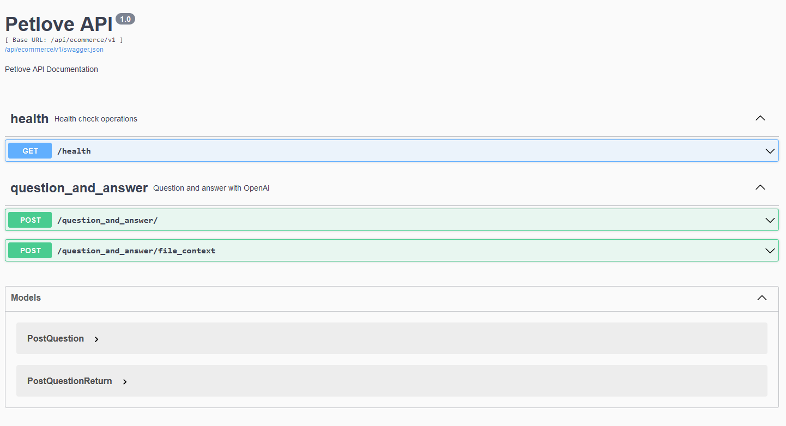

# Petlove Api Case
This project is part of a recruitment case for Petlove, wich involves a Flask application integrating the OpenAI API to serve as a sales assistant for the e-commerce users.

[](https://www.python.org/downloads/release/python-311/)
[](https://github.com/astral-sh/ruff)

## Technology and Resources

- [Python 3.11](https://www.python.org/downloads/release/python-311/) - **pre-requisite**
- [Docker](https://www.docker.com/get-started) - **pre-requisite**
- [Docker Compose](https://docs.docker.com/compose/) - **pre-requisite**
- [Gemini Api Key](https://ai.google.dev/gemini-api/docs/api-key?hl=pt-br) - **pre-requisite**
- [Pipenv](https://github.com/pypa/pipenv)
- [Flask](https://flask.palletsprojects.com/en)

_Please pay attention on **pre-requisites** resources that you must install/configure._

### API Docs

#### Routes

- `/`: The root path is a redirect to a swagger page
- `/metrics`: Prometheus metrics route
- `/api/ecommerce/v1/health`: Verify sure the application is up
- `/api/ecommerce/v1/question_and_answer`: Route to make a question to AI assistant

#### Route Params

`/api/ecommerce/v1/question_and_answer`: This route have 1 param

- question: Is the question which the AI assistant will respond to.

### Swagger Page



## Running Docker

### How to Build Docker

```
make docker/install
```

### How to Run

```
make docker/up
```

### How to Test

```
make docker/test
```

### Recommended command to running the application

```
make docker/install && make docker/up
```

## Running locally
### How to Install

```
make local/install
```

### How to Run

```
make local/run
```

### How to Test
```
make local/tests
```

### How to lint

`make docker/lint` or `make local/lint` to execute ruff's check

`make docker/lint/fix` or `make local/lint/fix` to execute ruff's fix

**Helpful commands**

_Please, check all available commands in the [Makefile](Makefile) for more information_.

## Project Details

_The project will be running at `http://localhost:5000/`_

The `entrypoint` of this project is the `run.py` file on the root path.

### Gemini instead of OpenAI

For the project, I will be using the Gemini API instead of OpenAI because Gemini offers a free tier. This allows for cost-effective experimentation and development.

### Monitoring and Observability

This project contains Prometheus and Grafana.

_Prometheus will be running at `http://localhost:9090/`_
_Grafana will be running at `http://localhost:3000/`_

A successful start should look like this on Prometheus:

_`http://localhost:9090/targets`_


### Grafana config

For Grafana configuration, you can follow these steps:

- **Login**: When you acess the Grafana page (`http://localhost:3000/`), login with username **admin** and password **admin**.
- **Data Source**: On Grafana's tab, click on **Data sources** and **Add data source**.
- **Prometheus**: Once in the Add data source page (`http://localhost:3000/connections/datasources/new`), select Prometheus. Finally, paste `http://prometheus:9090`.

This is how it should be once you done the steps.


Now, to add a Dashboard, go to the dashboards tab (`http://localhost:3000/dashboards`) and click on **New** > **Import**.
Here you can load with the ID `9688`, but you are free to choose any template.

This is the final result.


